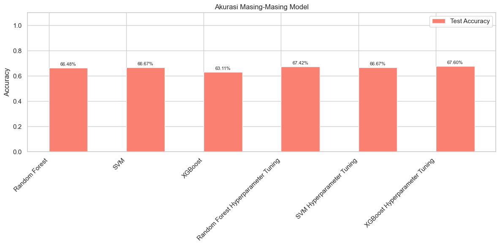

# Laporan Proyek Machine Learning - Christofel A Simbolon

## Domain Proyek
Proyek Machine Learning ini berfokus pada bidang Kesehatan Manusia dengan Sub Domain juga yaitu lingkungan.

### Latar Belakang
Kualitas air merupakan aspek vital dalam menjaga kesehatan manusia dan kelestarian lingkungan. Air yang tercemar dapat menjadi media penyebaran berbagai penyakit menular seperti diare, kolera, hingga gangguan organ dalam. Menurut data dari World Health Organization (WHO), sekitar 2 miliar orang di dunia masih mengonsumsi air yang terkontaminasi feses, yang dapat menyebabkan lebih dari 485.000 kematian akibat diare setiap tahunnya [WHO](https://www.who.int/news-room/fact-sheets/detail/drinking-water).

Di Indonesia, permasalahan air bersih masih menjadi isu utama, terutama di wilayah pedesaan, kawasan padat penduduk, dan daerah dengan infrastruktur sanitasi yang buruk. Air yang secara fisik terlihat jernih belum tentu aman untuk dikonsumsi karena bisa saja mengandung kontaminan kimia atau mikrobiologis yang berbahaya.

Permasalahan ini penting untuk diselesaikan karena menyangkut hak dasar manusia atas akses terhadap air bersih. Namun, pengujian kualitas air secara laboratorium sering kali memerlukan biaya tinggi dan waktu yang cukup lama. Oleh karena itu, dibutuhkan pendekatan yang efisien dan akurat, seperti pemanfaatan model machine learning, untuk memprediksi kelayakan air minum berdasarkan parameter-parameter fisik dan kimia yang dapat diukur secara langsung.

Berbagai penelitian telah dilakukan untuk mengidentifikasi parameter-parameter kualitas air, sebagaimana dijelaskan oleh Ansnawi et al. [1](https://www.researchgate.net/publication/374118371_Parameter_Kualitas_Air), yang membagi parameter menjadi tiga kategori utama: fisika (misalnya pH, turbidity), kimia (misalnya chloramines, sulfate), dan biologi. Di sisi lain, pendekatan berbasis machine learning telah terbukti efektif dalam mengklasifikasikan kualitas air. Shams et al. [2](https://link.springer.com/article/10.1007/s11042-023-16737-4#Sec17), dalam studi terbarunya, mengembangkan model prediksi potabilitas air menggunakan berbagai algoritma klasifikasi seperti Random Forest, XGBoost, dan AdaBoost, dengan bantuan metode Grid Search untuk optimasi performa.

Dengan adanya model prediktif berbasis machine learning, instansi pemerintah, perusahaan air minum, dan masyarakat dapat memperoleh alat bantu yang cepat dan murah untuk menilai kelayakan air. Hal ini diharapkan dapat mengurangi risiko kesehatan akibat konsumsi air yang tidak layak serta membantu pengambilan keputusan berbasis data dalam pengelolaan sumber daya air. 


## Business Understanding
Air bersih dan layak minum merupakan kebutuhan mendasar bagi kesehatan manusia. Sayangnya, tidak semua air yang tersedia memenuhi standar potabilitas. Mengonsumsi air yang tidak layak dapat meningkatkan risiko berbagai penyakit seperti diare, keracunan, hingga gangguan organ dalam. Oleh karena itu, penting untuk memiliki metode yang akurat dan efisien untuk mengidentifikasi air yang layak dikonsumsi.

Proyek ini bertujuan untuk mengembangkan model machine learning yang dapat mengklasifikasikan apakah air termasuk dalam kategori layak minum atau tidak, berdasarkan parameter-parameter fisik dan kimia yang terukur. Model ini diharapkan dapat digunakan oleh masyarakat, perusahaan, maupun instansi pemerintah sebagai alat bantu dalam proses monitoring dan pengendalian kualitas air. Dengan demikian, proyek ini tidak hanya memberikan manfaat dari sisi teknologi, tetapi juga berdampak langsung pada peningkatan kualitas hidup dan kesehatan masyarakat.

### Problem Statements
Berdasarkan Latar Belakang yang diberikan berikut adalah pertanyaan utama yang akan dijawab di proyek ini:
1. Bagaimana cara memprediksi apakah air layak dikonsumsi (potable) atau tidak berdasarkan parameter yang diberikan?
2. Algoritma Machine Learning apa yang paling optimal untuk mengklasifikasi kualitas air?
3. Apakah akurasi model dapat ditingkatkan dengan teknik tuning?

### Goals
Menjelaskan tujuan dari pernyataan masalah:
1. Mengembangkan model klasifikasi untuk memprediksi kelayakan air (potable atau tidak).
2. Membandingkan performa beberapa algoritma Machine Learning untuk mengetahui model terbaik.
3. Meningkatkan performa model dengan teknik hyperparameter tuning.

### Solution statements
1. Menggunakan beberapa algoritma Machine Learning untuk mengklasifikasikan apakah air layak dikonsumsi atau tidak.
2. Melakukan preprocessing data serta menggunakan hyperparameter tuning (GridSearchCV) untuk meningkatkan akurasi model terbaik.
3. Evaluasi performa model menggunakan metrik akurasi agar hasil dapat diukur dan dibandingkan secara objektif.

## Data Understanding
**Informasi Dari Dataset**
| Tipe | Keterangan |
| ------ | ------ |
| Title | Water Quality |
| Source | [Kaggle](https://www.kaggle.com/datasets/adityakadiwal/water-potability) |
| Maintainer | [Aditya Kadiwal](https://www.kaggle.com/adityakadiwal) |
| License | CC0: Public Domain |
| Visibility | Publik |
| Tags | Earth and Nature, Energy, Beginner, Public-Health, Environment,Binary Classification,Water Bodies|
| Usability | 10.00 |

**Struktur Dataset serta jumlah kolom dan baris**
|    |        ph |   Hardness |   Solids |   Chloramines |   Sulfate |   Conductivity |   Organic_carbon |   Trihalomethanes |   Turbidity |   Potability |
|---:|----------:|-----------:|---------:|--------------:|----------:|---------------:|-----------------:|------------------:|------------:|-------------:|
|  0 | nan       |    204.89  |  20791.3 |       7.30021 |   368.516 |        564.309 |          10.3798 |           86.991  |     2.96314 |            0 |
|  1 |   3.71608 |    129.423 |  18630.1 |       6.63525 |   nan     |        592.885 |          15.18   |           56.3291 |     4.50066 |            0 |
|  2 |   8.09912 |    224.236 |  19909.5 |       9.27588 |   nan     |        418.606 |          16.8686 |           66.4201 |     3.05593 |            0 |
|  3 |   8.31677 |    214.373 |  22018.4 |       8.05933 |   356.886 |        363.267 |          18.4365 |          100.342  |     4.62877 |            0 |
|  4 |   9.09222 |    181.102 |  17979   |       6.5466  |   310.136 |        398.411 |          11.5583 |           31.998  |     4.07508 |            0 |

3276 rows × 10 columns

### Variabel-variabel pada Water Quality dataset adalah sebagai berikut:
- `pH`: Menunjukkan tingkat keasaman atau kebasaan air; nilai aman menurut WHO adalah 6,5–8,5

- `Hardness` : Menunjukkan kandungan kalsium dan magnesium; memengaruhi kemampuan air membentuk busa sabun

- `Solids` : Total zat terlarut seperti mineral dan garam; batas ideal 500 mg/l, maksimum 1000 mg/l

- `Chloramines` : Zat disinfektan hasil campuran klorin dan amonia; aman jika ≤ 4 mg/l

- `Sulfate` : Senyawa alami dari batuan dan tanah; umumnya 3–30 mg/l di air tawar

- `Conductivity` : Mengukur kemampuan air menghantarkan listrik; dipengaruhi jumlah ion; batas WHO ≤ 400 μS/cm

- `Organic_carbon` : Mengindikasikan kandungan karbon dari senyawa organik; batas aman < 2 mg/l untuk air minum

- `Trihalomethanes` : Senyawa hasil samping dari disinfeksi klorin; aman hingga 80 ppm

- `Turbidity` : Menunjukkan kejernihan air; batas WHO adalah 5,00 NTU

- `Potability` : Menunjukkan kelayakan air untuk dikonsumsi; 1 = layak minum, 0 = tidak layak minum

### EDA - Cek Kualitas Data
1.Cek Ukuran Baris dan Kolom 
```python
# Melihat Ukuran Baris dan Kolom
print(f"Number of rows: {data.shape[0]}")
print(f"Number of columns: {data.shape[1]}")
```
Number of rows: 3276
Number of columns: 10

Kita mendapat jumlah Baris sebanyak 3276 dengan 10 baris 

2.Melihat informasi dari tipe data masing-masing variabel
```python
# Melihat Informasi Dataset
data.info()
```

```
Dataset Info:
-------------
- Total entries: 3276
- Total columns: 10

| #  | Column           | Non-Null Count | Dtype   |
|----|------------------|----------------|---------|
| 0  | ph               | 2785           | float64 |
| 1  | Hardness         | 3276           | float64 |
| 2  | Solids           | 3276           | float64 |
| 3  | Chloramines      | 3276           | float64 |
| 4  | Sulfate          | 2495           | float64 |
| 5  | Conductivity     | 3276           | float64 |
| 6  | Organic_carbon   | 3276           | float64 |
| 7  | Trihalomethanes  | 3114           | float64 |
| 8  | Turbidity        | 3276           | float64 |
| 9  | Potability       | 3276           | int64   |

- Memory Usage: 256.1 KB

```
Kita mendapat hasilnya yakni 10 kolom numerik dengan 9 kolom dengan tipe data float dan 1 kolom bertipe data int yakni **Potability** yang mana kolom ini nantinya akan kita gunakan sebagai target klasifikasi.

3.Menampilkan Statistika Deskriptif dari semua kolom 
```python
#Menampilkan Statistika Deskriptif dari data
data.describe(include="all")
```

| Statistik | ph       | Hardness | Solids    | Chloramines | Sulfate  | Conductivity | Organic_carbon | Trihalomethanes | Turbidity | Potability |
|-----------|----------|----------|-----------|-------------|----------|---------------|----------------|------------------|-----------|------------|
| Count     | 2785     | 3276     | 3276      | 3276        | 2495     | 3276          | 3276           | 3114             | 3276      | 3276       |
| Mean      | 7.08     | 196.37   | 22014.09  | 7.12        | 333.78   | 426.21        | 14.28          | 66.40            | 3.97      | 0.39       |
| Std       | 1.59     | 32.88    | 8768.57   | 1.58        | 41.42    | 80.82         | 3.31           | 16.18            | 0.78      | 0.49       |
| Min       | 0.00     | 47.43    | 320.94    | 0.35        | 129.00   | 181.48        | 2.20           | 0.74             | 1.45      | 0.00       |
| 25%       | 6.09     | 176.85   | 15666.69  | 6.13        | 307.70   | 365.73        | 12.07          | 55.84            | 3.44      | 0.00       |
| 50%       | 7.04     | 196.97   | 20927.83  | 7.13        | 333.07   | 421.88        | 14.22          | 66.62            | 3.96      | 0.00       |
| 75%       | 8.06     | 216.67   | 27332.76  | 8.11        | 359.95   | 481.79        | 16.56          | 77.34            | 4.50      | 1.00       |
| Max       | 14.00    | 323.12   | 61227.20  | 13.13       | 481.03   | 753.34        | 28.30          | 124.00           | 6.74      | 1.00       |

Dari kolom diatas kita bisa ambil beberapa kesimpulan yaitu:
-Missing Value di kolom ph,sulfate dan Trihalomethanes
-Untuk kolom Solids dan Trihalomethanes rentangnya cukup lebar
-Perlu Normalisasi Sebelum Modeling


4.Mengecek Missing Values:
```python
#Mengecek Missing Value
data.isna().sum()
```
```
ph                 491
Hardness             0
Solids               0
Chloramines          0
Sulfate            781
Conductivity         0
Organic_carbon       0
Trihalomethanes    162
Turbidity            0
Potability           0
dtype: int64
```
Setelah dilakukan pengecekan ternyata terdapat cukup banyak missing value di kolom ph,Sulafte dan Trihalomethanes.Missing values ini akan ditangani nantinya di Data preparation dengan melakukan inputasi menggunakan nilai rata-rata masing-masing kolom agar kita tidak kehilangan terlalu banyak data.

5.Cek Duplikat Data
```python
#Mengecek Total Duplikat Data
Total_duplikat = data.duplicated().sum()
print(Total_duplikat) 
```

```
0
```
Untuk Pengecekan Nilai duplkasi tidak didapat data yang duplikat.

6.Cek Outlier(Pencilan)

Dari gambar diatas dapat dilihat bahwa semua kolom memiliki outlier,untuk kolom **Potability** tidak dibuat karena hanya memiliki nilai 0 dan 1 saja.Outlier/Pencilan ini akan ditangai pada tahap Data Preparation dengan menggunakan Metode IQR.


### EDA - Univariate


Berdasarkan data distribusi numerik diatas kita mendapat informasi sebagai berikut:
1.`pH`:Memiliki distribusi yang mendekati normal dengan rata-rata berada disekitar angka 7,yang merupakan nilai netral untuk skala pH.
2.`Hardness`:Memiliki distribusi yang mendekati normal,dengan konsentrasi nilai berada pada kisaran 180-200.
3.`Solids`:Memiliki distribusi yang miring ke kanan(right-skewed).Akumulasi data cenderung pada nilai yang lebih rendah,dan terdapat beberapa nilai ekstrem dengan kadar mineral yang tinggi.
4.`Chloramines`:Memiliki distribusi yang hampir simetris dan mendekati normal.Nilai-nilainya sebagian besar berkisar antara 5-9,yang menunjukkan kebanyakan air mengandung campuran klorin dan amonia yang tinggi.
5.`Sulfate`:Memiliki distribusi yang miring ke kanan(positive skewed),dan sebagian besar data terkosentrasi di antara 200-350.Yang mana ini berarti kebanyakan air memiliki senyawa yang lebih besar dibandingkan normalnya.
6.`Conductivity`: Memiliki distribusi yang miring ke kanan,dan sebagian besar data terpusat di antara 300-500.Ini menandakan kebanyakan air masih dibatas WHO walaupun ada juga sebagian besar yang sudah melewati batas.
7.`Organic_carbon`:Memiliki distribusi yang mendekati normal dengan pusat distribusi nilai diantara 14-16 yang mana ini cukup berbahaya jika dibandingkan batas aman.
8.`Trihalomethanes`:Memiliki distribusi yang cenderung normal,meskipun sedikit cenderung ke kanan.Kebanyakan nilai berkumpul diantara 40-80.Menandakan kebanyakan air masih dalam batas aman.
9.`Turbidity`:Memiliki distribusi yang cenderung normal juga dengan kebanyakan data berpusat di kisaran 3,5-4,5.Ini menandakan bahwa kejernihan airnya masih dalam batas WHO.
10.`Potability`:Memiliki Distribusi yang sangat tidak seimbang dengan kebanyakan data menujukkan air yang tidak dapat diminum **0** dibandingkan yang layak diminum **1** .

### EDA - Multivariate


1.Pairplot
Pairplot ini memberikan gambaran hubungan antar dua fitur dan juga sebaran data terhadap Potability.Pola sebaran titik terhadap Potability tampak terdistribusi secara merata dalam sebagian besar fitur.Tidak ada kluster atau pemisahan yang jelas antara nilai Potability = 0 dan Potability = 1.
Sehingga cukup sulit membedakan antara air layak diminum dengan yang tidak.


2.Matriks Korelasi
Dari Matriks ini menunjukkan hubungan linier antar fitur, termasuk dengan target Potability.
Korelasi antara fitur-fitur dengan Potability semuanya sangat rendah, berada di kisaran -0.03 hingga 0.03.Ini menunjukkan tidak ada hubungan linier yang kuat antara fitur individual dengan label potability (layak minum atau tidak).
Fitur yang korelasinya relatif “paling tinggi” terhadap Potability adalah:
- Solids: korelasi positif 0.03
- Chloramines: 0.02
- Trihalomethanes: 0.01


## Data Preparation
Pada bagian ini Anda menerapkan dan menyebutkan teknik data preparation yang dilakukan. Teknik yang digunakan pada notebook dan laporan harus berurutan.
Berikut ini adalah tahapan-tahapan yang dilakukan saat data preparation:
- **Mengganti Missing Values dengan nilai rata-rata**
Pada tahap pertama ini, kita akn  menggantikan nilai hilang (missing values) pada kolom numerik dengan nilai rata-rata kolom tersebut.Data yang memiliki missing values dapat mengganggu proses pelatihan model karena kebanyakan algoritma tidak bisa menangani nilai NaN. Menggunakan nilai rata-rata adalah teknik yang digunakan untuk menjaga distribusi data dan menghindari penghapusan informasi berharga.
    ```python
    # Menampilkan Jumlah Missing Value sebelum imputasi 
    print("\nJumlah Missing Value Sebelum Imputasi:")
    print(data.isnull().sum())
    print(data.shape)
    
    # Imputasi nilai NaN dengan mean untuk setiap kolom numerik
    data = data.fillna(data.mean(numeric_only=True))
    
    # Tampilkan jumlah missing values SETELAH imputasi
    print("\nJumlah Missing Value Sebelum Imputasi:")
    print(data.isnull().sum())
    print(data.shape)
    ```
- **Menangani Outlier**
Tahap selanjutnya adalah menangani outlier dengan pendekatan IQR,dimana Outlier dapat mempengaruhi performa model secara signifikan.Dengan menggunakan metode IQR, kita dapat mendeteksi dan menghapus data ekstrem yang berada di luar rentang [Q1 - 1.5 x IQR , Q3 + 1.5 x IQR]. Hal ini bertujuan agar model tidak dipengaruhi oleh nilai-nilai yang tidak merepresentasikan populasi data secara umum.

    ```python
    # Ambil hanya kolom numerikal
    numeric_cols = data.select_dtypes(include='number').columns
    # Hitung Q1, Q3, dan IQR hanya untuk kolom numerikal
    Q1 = data[numeric_cols].quantile(0.25)
    Q3 = data[numeric_cols].quantile(0.75)
    IQR = Q3 - Q1
    # Buat filter untuk menghapus baris yang mengandung outlier di kolom numerikal
    filter_outliers = ~((data[numeric_cols] < (Q1 - 1.5 * IQR)) |
                        (data[numeric_cols] > (Q3 + 1.5 * IQR))).any(axis=1)
    # Terapkan filter ke dataset asli (termasuk kolom non-numerikal)
    data = data[filter_outliers]
    # Cek ukuran dataset setelah outlier dihapus
    data.shape
    ```
    Dengan Nilai awal adalah (3276, 10) menjadi (2666, 10) setelah pengapusan outlier.

- **Membagi Data Train dan Data Testing**
Tahapan yang selanjutnya adalah membagi data menjadi dua bagian: 80% untuk pelatihan dan 20% untuk pengujian.Proses pembagian  menggunakan train_test_split.Proses ini bertujuan agar model mampu belajar dari 80% data dan mampu melakukan evaluasi terhadap hasil belajarnya dari 20% data yang belum pernah ia lihat.Stratifikasi juga dilakukan untuk menjaga proporsi kelas target agar tetap seimbang di kedua set.
    ```python
    # Pisahkan features (X) dan target (y)
    x = data.drop('Potability', axis=1)  # Features: semua kolom kecuali Potability
    y = data['Potability']               # Target: kolom Potability
    
    # Split data menjadi train dan test (80:20)
    X_train, X_test, y_train, y_test = train_test_split(
        x, y, 
        test_size=0.2,        
        random_state=42,      
        stratify=y           
    )
    ```
- **Melakukan Standarisasi**
Tahapan terakhir adalah melakukan standarisasi data pada data numerik yang mana akan mengubah rata-rata(mean) menjadi 0 dan standard deviasi menjadi 1.Ini bertujuan agar setiap fitur numerik memiliki skala yang sama dan tidak mendominasi fitur lainnya.Serta Standarisasi membantu mempercepat konvergensi dan menghasilkan model yang lebih stabil

    ```python
    # Normalisasi fitur menggunakan Standard Scaling
    normalizer = StandardScaler()
    normalizer.fit(X_train)
    
    X_train_scaled = normalizer.transform(X_train)
    X_test_scaled = normalizer.transform(X_test)
    ```

## Modeling
Pada proyek ini, dilakukan pemodelan untuk memprediksi apakah air layak minum (potable) atau tidak menggunakan algoritma supervised learning. Tiga algoritma digunakan untuk dibandingkan performanya, yaitu Random Forest, Support Vector Machine (SVM), dan XGBoost. Selain itu, proses hyperparameter tuning juga dilakukan untuk mengoptimalkan kinerja dari model terbaik yang diperoleh.

### 1.Random Forest Classifier
Random Forest adalah algoritma ensemble learning berbasis bagging yang membangun banyak decision tree dan menggabungkan prediksinya (mayoritas voting untuk klasifikasi). Ini sangat berguna untuk mengurangi risiko overfitting dari decision tree tunggal.
```python
# Initialize the model
rf_model = RandomForestClassifier(random_state=42, n_estimators=100)
# Training model
rf_model.fit(X_train_scaled, y_train)
```
Alasan Pemilihan Parameter:
- n_estimators=100: Nilai default sering kali cukup baik. 100 pohon memberikan keseimbangan antara performa dan waktu pelatihan. Jumlah ini dipilih untuk memastikan variasi cukup tinggi antar pohon, tanpa memperlambat proses pelatihan secara signifikan.
- random_state=42: Menjamin replikasi hasil eksperimen.

Hyperparameter yang diberikan setelah GridSearch:
```
Best Random Forest Params: {'bootstrap': False, 'max_depth': 10, 'min_samples_leaf': 1, 'min_samples_split': 10, 'n_estimators': 300}
```

Kelebihan:
- Dapat menangani fitur numerik dan kategorikal secara langsung.
- Tidak memerlukan scaling data.
- Mengurangi variance karena averaging antar pohon.

Kekurangan:
- Interpretabilitas rendah, karena merupakan kumpulan banyak pohon (model kompleks).
- Lebih lambat dibanding model sederhana ketika jumlah estimator besar atau dataset sangat besar.

### 2.Support Vector Machine (SVM)
SVM bekerja dengan mencari optimal hyperplane yang memaksimalkan margin antara dua kelas. Pada kasus ini digunakan kernel RBF (Radial Basis Function) yang cocok untuk data non-linear karena dapat memetakan data ke dimensi yang lebih tinggi.

```python
# Initialize the model
svm_model = SVC(kernel='rbf', random_state=42) 
# Training model
svm_model.fit(X_train_scaled, y_train)
```

Alasan Pemilihan Parameter:
- kernel='rbf': Kernel RBF dipilih karena mampu menangkap relasi non-linear antar fitur, yang umum terjadi dalam data kimia seperti kualitas air.
- random_state=42: Untuk menjaga konsistensi hasil validasi (meskipun tidak semua kernel SVM tergantung pada random seed).

Hyperparameter yang diberikan setelah GridSearch:
```
Best SVM Params: {'C': 1, 'gamma': 'scale', 'kernel': 'rbf'}
```

Kelebihan:
- Kinerja tinggi dalam data berdimensi tinggi.
- Sangat efektif dalam kasus margin separation yang jelas antar kelas.

Kekurangan:
- Sangat sensitif terhadap scaling fitur — semua fitur harus dinormalisasi atau distandardisasi.
- Kurang efisien pada dataset besar karena kompleksitasnya O(n²).
- Pemilihan parameter seperti C dan gamma sangat berpengaruh terhadap performa.

### 3. XGBoost Classifier
XGBoost (Extreme Gradient Boosting) merupakan algoritma boosting berbasis gradient descent yang sangat efisien dan sering digunakan dalam kompetisi data science. Ia memperbaiki kesalahan prediksi dari pohon sebelumnya secara iteratif.

```python
# Initialize the model
XGBoost_Model = XGBClassifier(eval_metric='logloss', random_state=42)
# Training model
XGBoost_Model.fit(X_train_scaled, y_train)
```

Alasan Pemilihan Parameter:
- eval_metric='logloss': Karena ini adalah problem klasifikasi biner, logloss memberikan informasi seberapa baik prediksi probabilitas model. Dipilih karena lebih sensitif daripada sekadar akurasi.
- random_state=42: Untuk reprodusibilitas hasil.
- Parameter lain (default) digunakan pada tahap awal untuk baseline, sebelum tuning.

Hyperparameter yang diberikan setelah GridSearch:
```
Best XGBoost Params: {'colsample_bytree': 1.0, 'learning_rate': 0.01, 'max_depth': 7, 'n_estimators': 200, 'subsample': 0.8}
```

Kelebihan:
- Sangat cepat dan efisien karena dukungan paralelisasi dan optimasi internal.
- Mendukung regularization (alpha, lambda) sehingga dapat mengontrol overfitting dengan lebih baik.
- Menangani missing value secara otomatis.

Kekurangan:
- Memerlukan tuning parameter untuk hasil optimal (lebih kompleks).
- Interpretasi hasil lebih sulit dibanding model linier atau pohon tunggal.
- Bisa overfitting jika terlalu banyak iterasi dan model terlalu kompleks tanpa regularisasi yang cukup.


## Evaluation
Dalam proyek ini, kami menggunakan metrik evaluasi akurasi untuk mengevaluasi performa model klasifikasi. Metrik ini dipilih karena tujuan utama adalah mengetahui seberapa baik model dapat memprediksi kelayakan air minum secara keseluruhan. Akurasi memberikan gambaran umum mengenai proporsi prediksi yang benar dari semua data.
Rumus Accuracy:

$$
\text{Accuracy} = \frac{\text{TP} + \text{TN}}{\text{TP} + \text{TN} + \text{FP} + \text{FN}} \times 100\%
$$

Keterangan:
- TP (True Positive): Data positif yang diprediksi benar sebagai positif.
- TN (True Negative): Data negatif yang diprediksi benar sebagai negatif.
- FP (False Positive): Data negatif yang salah diprediksi sebagai positif (Kesalahan Tipe I).
- FN (False Negative): Data positif yang salah diprediksi sebagai negatif (Kesalahan Tipe II).

Berikut adalah hasil akurasi model sebelum dan sesudah melakukan Hyperparameter Tuning:

| Model | Accuracy |
| ------ | ------ |
| RandomForest | 0.6647 |
| SVM  | 0.6667 |
| XGBoost | 0.6311 |
| RandomForest Hyperparameter Tuning | 0.6742 |
| SVM Hyperparameter Tuning | 0.6667 |
| XGBoost Hyperparameter Tuning | 0.6760 |



**Kesimpulan Evaluasi**
Dari Hasil Akurasi Tabel maupun gambar dapat dilihat bahwa model yang terbaik sebelum dilakukan Parameter Tuning adalah SVM, namun setelah dilakukan Parameter Tuning model XGBoost meningkat paling signifikan, dan menjadi yang terbaik secara akurasi.Jadi dapat diambil kesimpulan bahwa model terbaik adalah XGBoost setelah Parameter Tuning.

## Kesimpulan
Proyek ini berhasil menjawab problem statement dan goals yang diberikan.Kita berhasil untuk memprediksi apakah suatu air minum dapat dikonsumsi atau tidak lewat pengembangan machine learning.Kita juga mendapat algortima machine learning mana yang paling optimal untuk mengklasifikasikan air mana yang layak diminum dan tidak yaitu algoritma XGBoost.Walaupun secara akurasi lebih bisa ditingkatkan mungkin lewat melakukan penyeimbangan dataset atau beberapa proses lain untuk meningkatkan akurasi dan mencegah model mengalami overfit.Diharapkan model ini dapat membantu masyarakat,perusahaan dan pemerintah sebagai alat bantu melakukan monitoring kualitas air.


